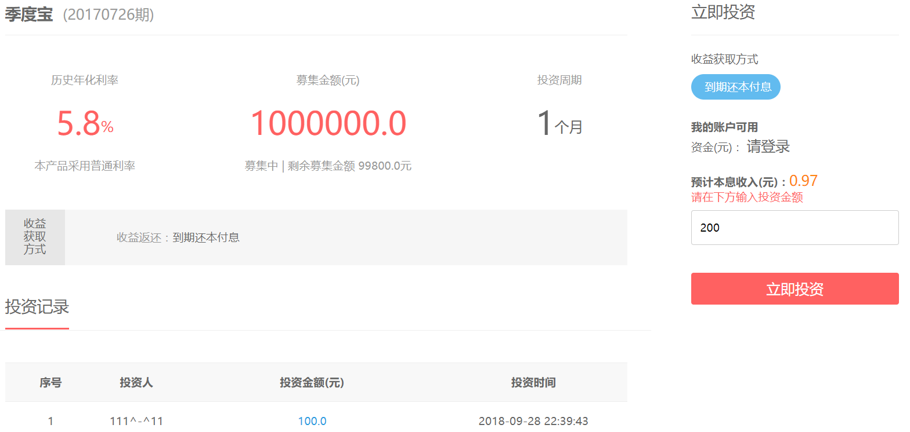
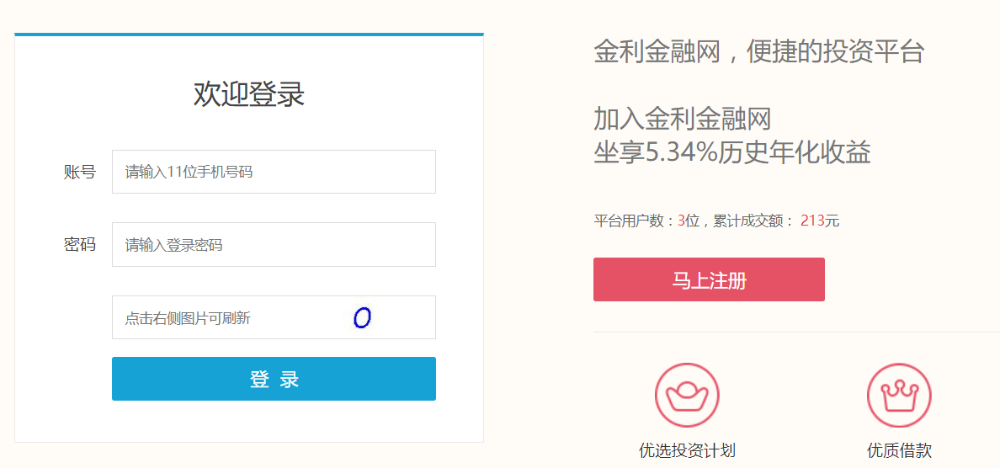
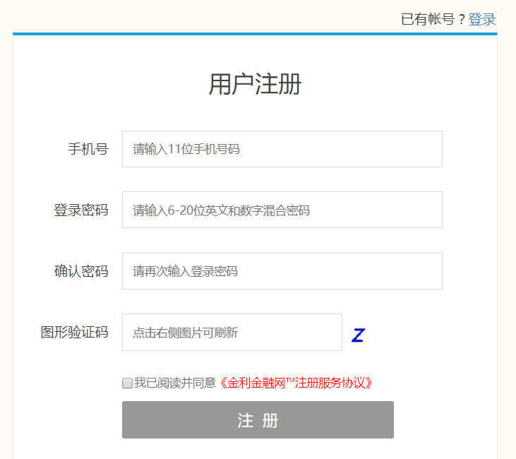
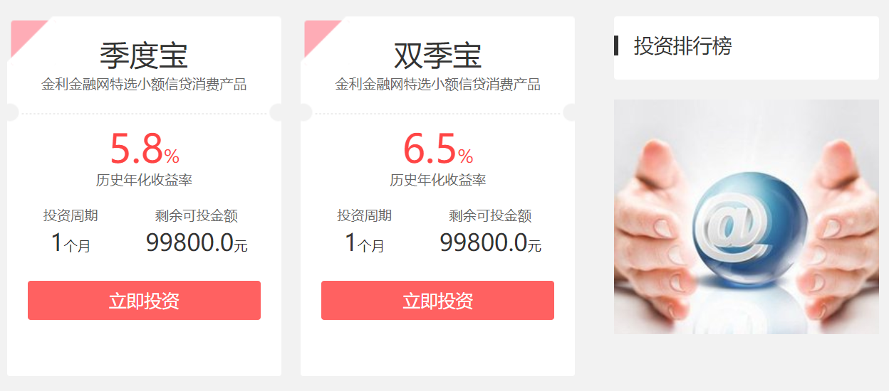

## index
  
## detail
  
## login
  
## register
  
## products
  

# 模块说明
此系统采用Maven管理整个项目，多模块化的SSM框架。主要分为前台web系统、dubbo数据接口系统、支付系统、实名认证系统、后台管理系统、合同签章系统、订单系统。
## p2p-parent  
父类pom  
## p2p-commons  
系统常量及公共类  
## p2p-dataservice  
服务端dubbo服务，提供业务处理和数据访问  
## p2p-exterface  
dubbo服务的接口层：提供系统接口和实体类  
## p2p-web  
系统前台，用户直接访问工程  
    
    #备注
    1.启动zookeeper和redis
    2.在application.properties配置相关数据源
    #首先启动dataservice系统，端口8081
    3.http://localhost:8081
    #web系统，端口8080
    4.http://localhost:8080
